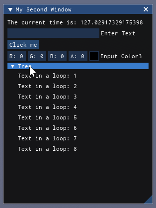

# Axios

Axios is a lightweight Immediate-Mode GUI library for Roblox, distributed as a single-file bundle ready for `loadstring`. It's designed for internal script layers and exploit-ready environments.



## Why Axios?

- **Immediate Mode:** Declare your UI every frame; Axios handles the creation, updates, and memory management.
- **Feature-Rich:** Includes windows, buttons, sliders, drag inputs, combo boxes, tables, plots, and more.
- **State System:** Built-in state objects persist throughout frames and bind directly to widgets.
- **Configurable:** Global or per-widget style overrides for themes, colors, and fonts.

## Quick look

```lua
local Axios = loadstring(game:HttpGet("https://load.axios.x5i.ch"))()
Axios:Init()

Axios:Connect(function()
    Axios.Window({"Hello Axios!"})
        Axios.Text({"You are amazing."})
        if Axios.Button({"Thanks!"}).clicked() then
            print("Button clicked!")
        end
    Axios.End()
end)
```

## Documentation

- [Getting Started](getting-started.md): Install and initial setup.
- [API Reference](api/README.md): Documentation for Init, State, Config, IDs, and lifecycle.
- [Widgets](widgets/README.md): Catalog of all widgets with examples.
- [Advanced](advanced/README.md): Custom cycles, dynamic config, and design patterns.
- [Credits](credits.md)
