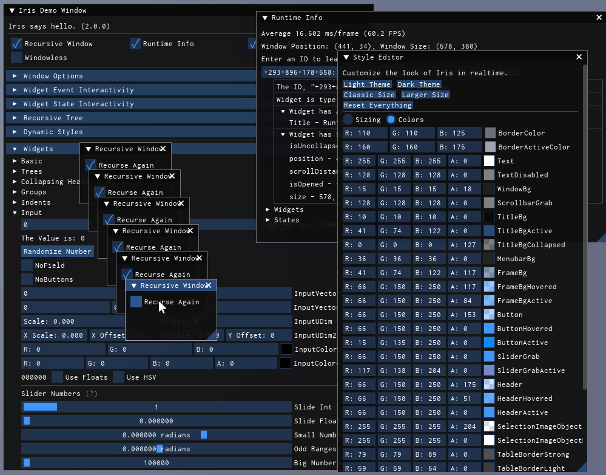

# Lifecycle Management

These core functions control Axios's rendering loop, UI flow, and cleanup processes.

---

## Axios:Connect(callback)

Registers a function to be executed every render frame. This is the primary method for declaring your UI logic. The function returns a disconnect function that stops further execution of the callback.

```lua
-- Start rendering a simple window
local stopUI = Axios:Connect(function()
    Axios.Window({"Main Menu"})
        Axios.Text({"System online."})
    Axios.End()
end)

-- Stop the UI update loop when no longer needed
stopUI()
```

Multiple scripts can connect their own independent callbacks simultaneously without conflict:

```lua
-- script_a.lua
Axios:Connect(function()
    Axios.Window({"Module Alpha"}) Axios.End()
end)

-- script_b.lua
Axios:Connect(function()
    Axios.Window({"Module Beta"}) Axios.End()
end)
```

**Note:** Ensure `Axios:Init()` has been called before connecting any callbacks to avoid warnings and potential errors.

---

## Axios.End()

Formally closes the currently open container widget. You must match every opening container call (Window, Menu, Tree, TabBar, Tab, SameLine, Indent, Group, Combo, Table) with a corresponding `End()` call.

```lua
Axios.Window({"Dashboard"})
    Axios.Tree({"Environmental Settings"})
        Axios.Text({"Ambient Occlusion: Enabled"})
    Axios.End()  -- closes the Tree
Axios.End()      -- closes the Window
```

An incorrect number of `End()` calls will trigger an error, either `"Callback has too few calls to Axios.End()"` or `"Too many calls to Axios.End()."`.

---

## Axios.Shutdown()

Terminates all Axios operations. This function disconnects active events, destroys all UI instances, and performs memory cleanup. Once shutdown, the library cannot be re-initialized.

```lua
Axios.Shutdown()
```

---

## Axios.Append(userInstance)

Injects a standard Roblox `GuiObject` directly into the Axios widget tree. The provided instance is automatically parented to whichever container is currently active in the render stack.

```lua
local customFrame = Instance.new("Frame")
customFrame.Size = UDim2.fromOffset(120, 60)
customFrame.BackgroundColor3 = Color3.fromRGB(45, 140, 255)

Axios.Window({"Custom Integration"})
    -- Axios now manages the placement of this raw frame
    Axios.Append(customFrame)
Axios.End()
```

---

## Axios.ShowDemoWindow

An integrated demo that showcases every available widget in the library. This is a highly recommended tool for learning the API or debugging visual styles.

```lua
Axios:Connect(Axios.ShowDemoWindow)
```



---

## Axios.SetFocusedWindow(window)

Forces a specific window instance to the front of the display stack, giving it visual priority.

```lua
local myWindow = Axios.Window({"Background Interface"})
Axios.End()

-- bring the background interface to the front
Axios.SetFocusedWindow(myWindow)
```

---

## Axios.Disabled

A boolean flag used to pause entire library updates. When set to `true`, all widgets remain visible in their last-known state but cease responding to input or logic updates.

```lua
Axios.Disabled = true  -- pause all UI updates and input
Axios.Disabled = false -- resume normal operations
```
