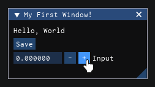

# Getting Started

## Installation

Just copy this into your executor or terminal:

```lua
local Axios = loadstring(game:HttpGet("https://load.axios.x5i.ch"))()
Axios:Init()
```

Both `Axios.Init()` and `Axios:Init()` are valid, depending on your preferred syntax.

## Creating your first UI

All UI logic should reside inside a `Connect` callback. This function is called every time a render cycle occurs.

```lua
Axios:Connect(function()
    Axios.Window({"My First Script"})
        Axios.Text({"Welcome to Axios!"})

        if Axios.Button({"Click me"}).clicked() then
            print("Button was clicked!")
        end

        local name = Axios.State("")
        Axios.InputText({"Your name:"}, {text = name})
        Axios.Text({"Hello, " .. name:get()})
    Axios.End()
end)
```



## Core Concepts

**Call `Axios.End()` for containers:** Any widget that groups content (Window, Menu, TabBar, Tree, SameLine, Indent, Group, Combo, Table) must have a matching `End()` call. This applies even if the container is currently empty.

```lua
Axios.Window({"Empty Window"})
Axios.End() -- required for the container to close correctly
```

**Auto-parenting:** Widgets are automatically nested inside the most recently opened container.

```lua
Axios.Window({"Parent"})
    Axios.Tree({"Section"})
        Axios.Text({"I'm inside the tree"})
    Axios.End() -- closing the Tree
Axios.End() -- closing the Window
```

**Initialize once:** Calling `Axios:Init()` multiple times will result in an error unless you pass `true` as the third argument.

**Persistence through State:** Standard local variables within the `Connect` callback reset on every frame. Use `Axios.State()` to persist data across render cycles.

```lua
Axios:Connect(function()
    -- this will reset to 0 every frame
    local count = 0

    -- this will persist between frames
    local count = Axios.State(0)
end)
```

## Further Reading

- [API Reference](api/README.md): A detailed look at the core library functions.
- [Widgets](widgets/README.md): The full catalog of available UI components.
- [Advanced Usage](advanced/README.md): Manual cycles, dynamic styling, and complex script patterns.
